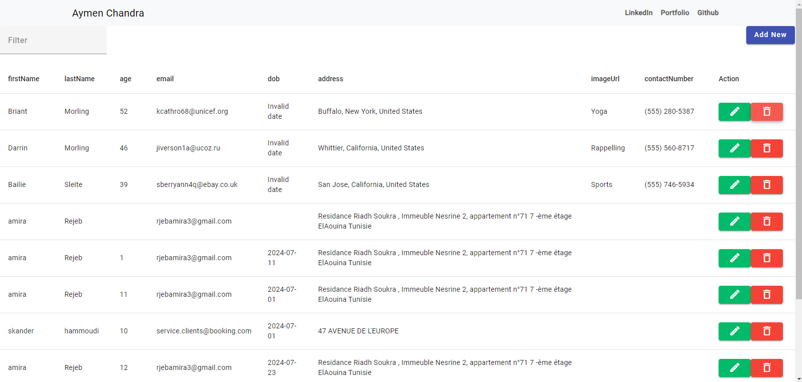

# Angular Material Data Table 



## Project Setup
```
npm install 
```

### Run Project
```
ng serve
```
## Features
```
Add Employee ➕
Edit Employee ✏️
Delete Employee ❌ 
Validation Forms✅
Data filter 🔍
Pagination 🔢
Sorting📶
```

## Used Package
```
Angular material
material-icons
SweetAlert2
```
